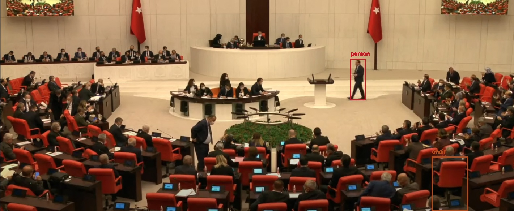

# ZoomVision : Slicing Aid Detection
A simple, high level, easy-to-use open source Computer Vision library for Python.

## Installation

### Installing dependencies

Provided the below python packages are installed, deepvision is completely pip installable.

* OpenCV
* TensorFlow
* DeepVision

If you don't have them already installed, you can install through pip

`pip install opencv-python tensorflow deepvision` 

#### Optional
or you can compile them from source if you want to enable optimizations for your specific hardware for better performance.
If you are working with GPU, you can install `tensorflow-gpu` package through `pip`. Make sure you have the necessary Nvidia drivers  installed preoperly (CUDA ToolKit, CuDNN etc). 

If you are not sure, just go with the cpu-only `tensorflow` package.

You can also compile OpenCV from source to enable CUDA optimizations for Nvidia GPU.

## Object detection 
Detecting common objects in the scene is enabled through a single function call `utils.SlicedDetection(image,model="yolov4")`. It will return the bounding box co-ordinates, corrensponding labels and confidence scores for the detected objects in the image.

### Example :


```python
from utils import utils
import cv2

image = cv2.imread("images/test.png")
utils.SlicedDetection(image,model="yolov4")
```
Underneath it uses [YOLOv4](https://github.com/AlexeyAB/darknet) model trained on [COCO dataset](http://cocodataset.org/) capable of detecting 80 objects.

### Sample output :

# With ZoomVision


# Without ZoomVision


## Citation
If you find zoomvision helpful in your work, please cite the following
```BibTex
@misc{ar2021zoomvision,
  author =       {Nurettin Sinanoğlu},
  title =        {zoomvision - Easy to use Computer Vision library for Python},
  howpublished = {\url{https://github.com/Lynchez/deepvision}},
  year =         {2021}
}
```

